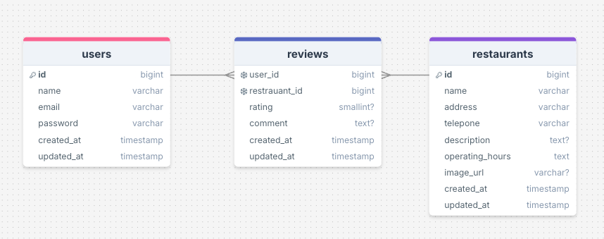

<p align="center"><a href="https://laravel.com" target="_blank"></a></p>

<p align="center">
<a href="https://github.com/laravel/framework/actions"></a>
<a href="https://packagist.org/packages/laravel/framework"></a>
<a href="https://packagist.org/packages/laravel/framework"></a>
<a href="https://img.shields.io/packagist/l/laravel/framework" alt="License"></a>
</p>

# みんなで作る焼肉店レビューアプリ

このアプリは、コミュニティベースの京都の焼肉店レビューWebアプリケーションです。**ユーザー全員が焼肉店の情報やレビューを投稿・共有**し、協力して情報を育てることを目指します。ユーザー認証、画像投稿、口コミ投稿など、基本的なWebアプリ機能を備えています。

## 主な機能

* **焼肉店の情報共有・管理（CRUD）**:
    * **店舗の登録・編集・削除**: ログインユーザーが焼肉店情報を追加・更新・削除。
    * **店舗詳細表示**: 各焼肉店の基本情報（名称、説明、場所など）を表示。
    * **店舗の画像投稿**: 複数の画像をアップロードし、店舗の魅力を視覚的にアピール。
    * **メニュー情報の充実**: メニュー名、価格、説明などを登録・表示し、店舗選びの判断材料に。
* **ユーザーレビュー機能（CRUD）**:
    * **レビュー投稿**: ログインユーザーが店舗に評価（1～5段階星）とコメントを投稿（店舗ごとに1ユーザー1回）。
    * **レビュー一覧と平均評価**: 店舗ごとのレビューを一覧表示し、平均評価を自動計算。
    * **レビューの編集・削除**: 投稿者自身がレビュー内容を編集・削除。
* **ユーザー認証**: Laravel Breezeによるユーザー登録、ログイン、パスワードリセット機能。
* **共通UI/UX**: 一貫性のあるヘッダー・フッターを導入し、直感的な操作性を提供。
* **検索フォーム**: 焼肉店名や口コミ数や評価で情報を検索。

## 技術スタック

* **バックエンド**: PHP (例: 8.2以上), Laravel Framework (例: 10.x / 11.x), PostgreSQL, Laravel Breeze
* **フロントエンド**: HTML / Blade, Tailwind CSS, JavaScript
* **開発環境**: Docker / Laravel Sail (推奨), pgAdmin (任意)

## データベース設計（ER図）

本アプリケーションの主要なエンティティとその関係を図で示します。


## 開発環境のセットアップ

このプロジェクトは **Laravel Sail** の利用を前提としています。

1.  **Docker Desktopのインストールと起動**
2.  **リポジトリのクローン**:
    ```bash
    git clone [あなたのGitHubリポジトリのURL]
    cd [プロジェクト名]
    ```
3.  **.env ファイルの設定**: `.env.example` をコピーし、DB設定 (`DB_HOST=pgsql`など) を確認。
    ```bash
    cp .env.example .env
    ```
4.  **Laravel Sailコンテナ起動と依存パッケージインストール**:
    ```bash
    ./vendor/bin/sail up -d
    ./vendor/bin/sail composer install
    ```
5.  **アプリケーションキーの生成**:
    ```bash
    ./vendor/bin/sail artisan key:generate
    ```
6.  **データベースマイグレーション実行**:
    ```bash
    ./vendor/bin/sail artisan migrate
    ```
7.  **シーダーの実行**: 初期データを投入。
    ```bash
    ./vendor/bin/sail artisan db:seed
    ```
8.  **フロントエンドアセットのコンパイル**:
    ```bash
    ./vendor/bin/sail npm install # 初回のみ
    ./vendor/bin/sail npm run dev  # または npm run build
    ```
9.  **アプリケーションのアクセス**: ブラウザで `http://localhost` または `http://localhost:80` へアクセス。

## 今後の展望（Future Enhancements）

ユーザー体験向上と多機能化を目指し、以下の機能拡張を計画しています。

* **店舗情報のさらなる充実**:
    * メニュー写真の登録・表示。
    * 店舗のタグ付けによる検索性向上。
* **地図・位置情報連携**: Google Maps/Places API連携による地図表示や情報取得。
* **予約サイトへの連携**: 店舗詳細からの外部予約サイトへのリンク。
* **UI/UXのさらなる洗練**: アニメーション、レスポンシブデザイン強化、エラー表示・入力補助の改善。
* **コミュニケーション機能の強化**:
    * レビューに対する「いいね」機能。
    * レビューへの返信機能による活発な交流促進。
* **通知機能とダッシュボード強化**: 新着レビューや新店舗情報のダッシュボード表示、プッシュ通知。
* **コンテンツモデレーション機能**: 悪質コメントの報告・削除機能による健全なコミュニティ運営。
* **お気に入り機能**: 特定の焼肉店をお気に入り登録・管理。
