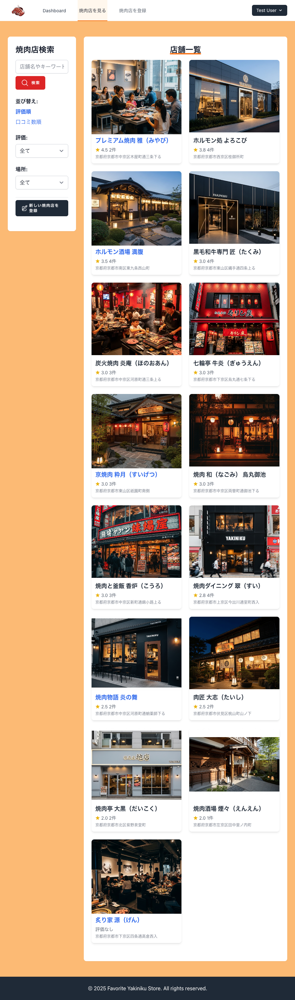
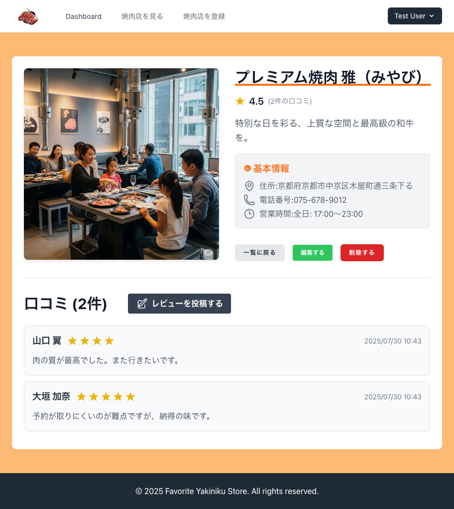

# みんなで作る焼肉店レビューアプリ

このアプリは、**コミュニティベースの京都焼肉店レビューWebアプリケーション**です。  
ユーザー全員が焼肉店の情報やレビューを投稿・共有し、協力して情報を育てることを目指します。  
ユーザー認証、画像投稿、口コミ投稿など、基本的なWebアプリ機能を備えています。

---

## 🎯 なぜ作るのか（Problem & Goal）

**対象:** 京都の焼肉店に興味のある地元住民・観光客・焼肉好きな人  
**現状の課題:**  
- 全国規模のレビューサイトはあっても、**地域に根ざした詳細情報やローカルならではの視点が少ない**  
- 古い情報や広告色の強いレビューが多く、**信頼できる生の声を探しにくい**  
- 「知る人ぞ知る名店」や地元民が通う店の情報が埋もれやすく、**観光客が見つけにくい**  
- 京都という土地柄、国内外からの旅行客が多く、**焼肉選びで失敗したくないニーズが高い**


**提供価値:**
- 京都に特化した焼肉店情報を**コミュニティで最新化・共有**
- ローカル視点のおすすめ・注意点がわかる仕組み

---

## 🩺 開発背景
開発者は京都に住んでいますが、地元で評判の美味しい焼肉店が、大手グルメサイトでは情報が埋もれて見つけにくいことに気づきました。
さらに、検索結果のヒット数が多すぎて、実際にどこを選べばいいのか判断しづらいという課題もあります。
そこで、「こういうお店の情報こそ、地元の人や訪れた人が共有できたら便利で楽しいのでは？」と考え、
**地域住民と観光客が協力して作る京都特化の焼肉レビューアプリ**を開発しました。


---

## 🎯 ゴール

- 京都の焼肉店レビューを**コミュニティで継続的に更新**  
- 初めての人でも店舗選びで失敗しない環境を整える  
- ユーザー同士の交流と情報共有を促進する

---

## 📈 成功指標（KPI）

> 以下は開発者が設定した運用目標です。実際の数値は利用状況によって変動します。

- **店舗カバー率:** 京都市内の焼肉店の70%以上を掲載（1年以内）  
- **レビュー平均更新間隔:** 各店舗ページが**3か月以内のレビュー**を保持  
- **アクティブユーザー率:** 登録ユーザーの月間アクティブ率50%以上  
- **写真付きレビュー比率:** 投稿のうち写真付きが60%以上  
- **ユーザー満足度:** 「店舗選びに役立った」と回答する割合80%以上

---

## 📷 画面イメージ
| ダッシュボード | 店舗一覧 | 店舗詳細 |
|---|---|---|
|  |  |  |

---

## 🎨 デザイン・UI/UXコンセプト

**「暖かみのあるモダン」**をテーマに、京都の地域性と焼肉の楽しさを表現。

- **カラー**  
  - 背景: `bg-orange-700`（暖かみ・食欲をそそる）  
  - コンテンツ背景: `bg-white`（読みやすく情報を際立たせる）  
  - テキスト: `text-gray-900`（可読性高）  
  - サブテキスト: `text-gray-600`（情報の階層化）

- **フォント**  
  - メイン: `BIZ UDPGothic`（ユニバーサルデザインで誰でも読みやすい）

- **UX工夫**  
  - カスタムカーソル（焼肉アイコン）  
  - オリジナルファビコン＆ロゴでブランド統一

---

## 🔧 技術スタックと選定理由

| 技術 | 用途 | 選定理由 |
|------|------|----------|
| **PHP 8.3 + Laravel 12** | バックエンド | シンプルなCRUD実装と拡張性の高いMVC構造、認証・バリデーション・ストレージ機能が標準で充実 |
| **PostgreSQL** | データベース | 今後、地図API連携時の位置情報検索にも対応可能 |
| **Laravel Breeze** | 認証機能 | 軽量かつカスタマイズしやすい認証 |
| **Blade + Tailwind CSS** | フロントエンド | UI開発の高速化とレスポンシブ対応が容易、京都の雰囲気を出すデザインに適用しやすい |
| **Docker + Laravel Sail** | 開発環境 | 環境構築の一貫性確保、チーム開発での差異防止 |
| **pgAdmin** | DB管理 | GUIでスキーマやデータ操作が容易 |

---

## 🗄 データベース設計（ER図）


---

## ⚙️ 開発環境セットアップ

1. **Docker Desktopを起動**  
2. **リポジトリのクローン**  
    ```bash
    git clone https://github.com/akihide-hatano/favorite-yakiniku-app.git
    cd favorite-yakiniku-app

    ```
3. **.env設定**  
    ```bash
    cp .env.example .env
    ```
4. **コンテナ起動 & 依存インストール**  
    ```bash
    ./vendor/bin/sail up -d
    ./vendor/bin/sail composer install
    ```
5. **キー生成**  
    ```bash
    ./vendor/bin/sail artisan key:generate
    ```
6. **マイグレーション & シード**  
    ```bash
    ./vendor/bin/sail artisan migrate --seed
    ```
7. **フロントエンドビルド**  
    ```bash
    ./vendor/bin/sail npm install
    ./vendor/bin/sail npm run dev
    ```
8. **アクセス**  
    ブラウザで `http://localhost`

---

## 🚀 今後の展望

- 店舗メニュー写真登録・タグ検索
- Google Maps API連携による地図表示
- 外部予約サイトリンク
- UI/UX強化（アニメーション・レスポンシブ）
- レビューへの「いいね」や返信機能
- プッシュ通知
- コメントモデレーション
- お気に入り店舗管理

